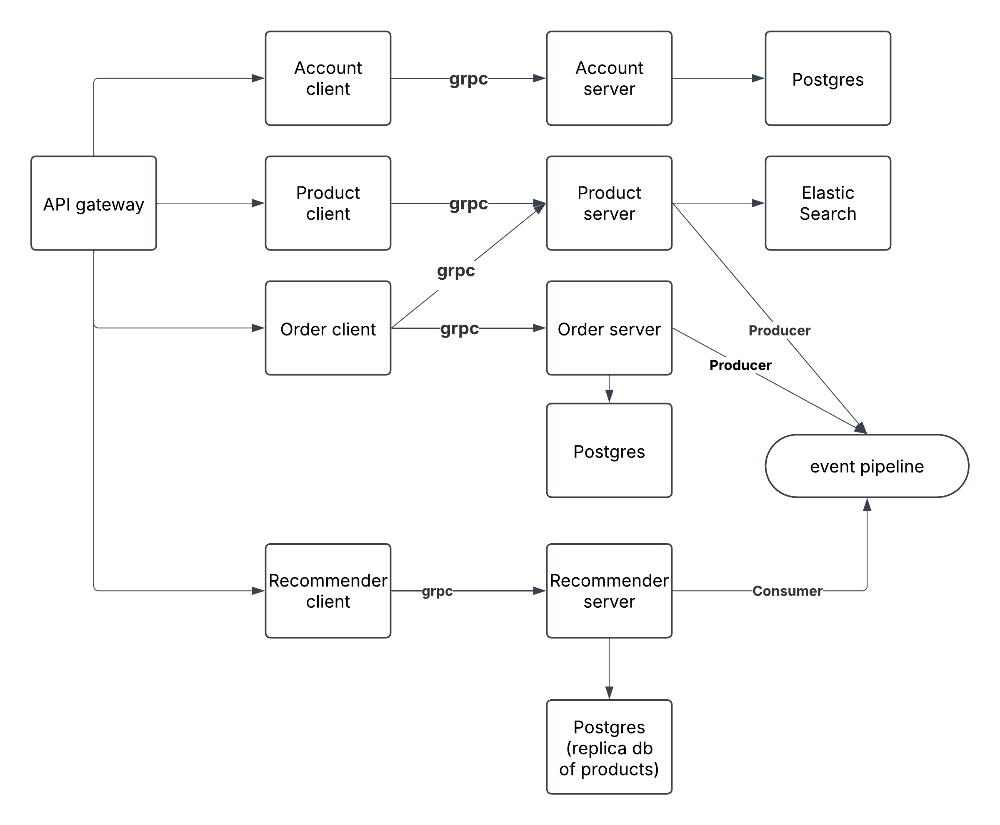

# 📊 Microservices System - Analysis and Design

This document outlines the **analysis** and **design** process for the EcomMicroGolang microservices-based e-commerce system.

---

## 1. 🎯 Problem Statement

The EcomMicroGolang system is designed to provide a scalable, maintainable e-commerce platform with modern features.

- **Users**: Customers looking to browse and purchase products, and sellers managing product listings
- **Main Goals**:
  - Allow users to browse, search, and purchase products
  - Provide personalized product recommendations
  - Enable account management
- **Data Processed**:
  - User account information
  - Product catalog data
  - Order and transaction records
  - User interaction data for recommendations

---

## 2. 🧩 Identified Microservices

| Service Name | Responsibility                                        | Tech Stack                        |
| ------------ | ----------------------------------------------------- | --------------------------------- |
| Account      | User authentication, registration, profile management | Go, PostgreSQL, gRPC              |
| Product      | Product catalog, search, and management               | Go, Elasticsearch, gRPC           |
| Order        | Order processing, history, and management             | Go, PostgreSQL, gRPC              |
| Recommender  | Product recommendations based on user behavior        | Python, PostgreSQL, SVD algorithm |
| GraphQL      | API Gateway that integrates all services              | Go, GraphQL, gqlgen               |

---

## 3. 🔄 Service Communication

The system uses a combination of communication patterns:

- **API Gateway Pattern**: The GraphQL service acts as an API gateway, providing a unified interface to clients
- **Service-to-Service Communication**: gRPC for efficient, type-safe communication between microservices
- **Event-Driven Communication**: Kafka for asynchronous events (e.g., product views, purchases)

Communication flows:

- Client ⇄ GraphQL Gateway (GraphQL/HTTP)
- GraphQL ⇄ Account/Product/Order/Recommender (gRPC)
- Product ⇄ Kafka ⇄ Recommender (Event streaming)
- Order ⇄ Account/Product (gRPC for validation)

---

## 4. 🗂️ Data Design

Each service maintains its own database, following the database-per-service pattern:

- **Account Service**:

  - PostgreSQL database
  - Tables: accounts (id, name, email, password_hash, created_at)

- **Product Service**:

  - Elasticsearch for efficient product search
  - Documents: products (id, name, description, price, account_id)

- **Order Service**:

  - PostgreSQL database
  - Tables: orders (id, account_id, total_price, created_at), order_items (order_id, product_id, quantity, price)

- **Recommender Service**:
  - PostgreSQL database
  - Tables: interactions (user_id, product_id, interaction_type, timestamp), product_replicas (id, name, description, price)

---

## 5. 🔐 Security Considerations

- **Authentication**: JWT-based authentication implemented in the Account service
- **Authorization**: Role-based access control for different API operations
- **API Security**: GraphQL validation and rate limiting
- **Data Protection**: Password hashing using bcrypt
- **Service Security**: Internal services not exposed directly to clients
- **Transport Security**: TLS for all service communications

---

## 6. 📦 Deployment Plan

- **Containerization**: Docker containers for each service
- **Orchestration**: Docker Compose for local development and testing
- **Configuration**: Environment variables for service configuration
- **Database Management**: Separate database containers with volume persistence
- **Messaging**: Kafka and Zookeeper containers for event processing
- **Scaling**: Horizontal scaling capability for all services

---

## 7. 🎨 Architecture Diagram



Text-based representation of the architecture:

```
+----------------+
|    Clients     |
|  (Web/Mobile)  |
+-------+--------+
        |
        v
+-------+--------+
|  GraphQL API   |
|    Gateway     |
+--+------+------+
   |      |      |
   v      v      v
+--+--+ +-+--+ +-+-------+
|Acct | |Prod| |  Order  |
|Svc  | |Svc | |  Svc    |
+--+--+ +-+--+ +----+----+
   |      |          |
   v      v          v
+--+--+ +-+--+    +--+--+
|Acct | |Prod|    |Order|
| DB  | | DB |    | DB  |
+-----+ +--+-+    +-----+
            |
            v
        +---+----+    +------------+
        | Kafka  +<---+ Recommender|
        +--------+    |   Sync     |
                      +------+-----+
                             |
                             v
                      +------+-----+
                      |Recommender |
                      |  Service   |
                      +------+-----+
                             |
                             v
                      +------+-----+
                      |Recommender |
                      |    DB      |
                      +------------+
```

---

## ✅ Summary

The EcomMicroGolang architecture is designed with scalability, maintainability, and performance in mind:

- **Scalability**: Each microservice can be independently scaled based on demand. For example, the Product service might need more resources during sales events, while the Recommender service might require more computing power as the user base grows.

- **Maintainability**: The separation of concerns allows different teams to work on different services without affecting each other. The use of gRPC for service communication ensures type safety and clear contracts between services.

- **Performance**:

  - Elasticsearch provides fast product search capabilities
  - GraphQL allows clients to request exactly the data they need
  - The recommender service uses SVD algorithm for efficient recommendations
  - Kafka enables asynchronous processing of events

- **Resilience**: Services are designed to be resilient to failures in other services. For example, if the recommender service is down, the system can still function with default recommendations.

- **Extensibility**: New services can be added to the system without major changes to existing services. The event-driven architecture allows for loose coupling between services.

This architecture supports the independent development, testing, and deployment of each service, enabling faster iteration and reduced risk when making changes.

## Author

This analysis was created for the EcomMicroGolang project.

- GitHub: https://github.com/Jacknguyen999/EcomMicroGolang
